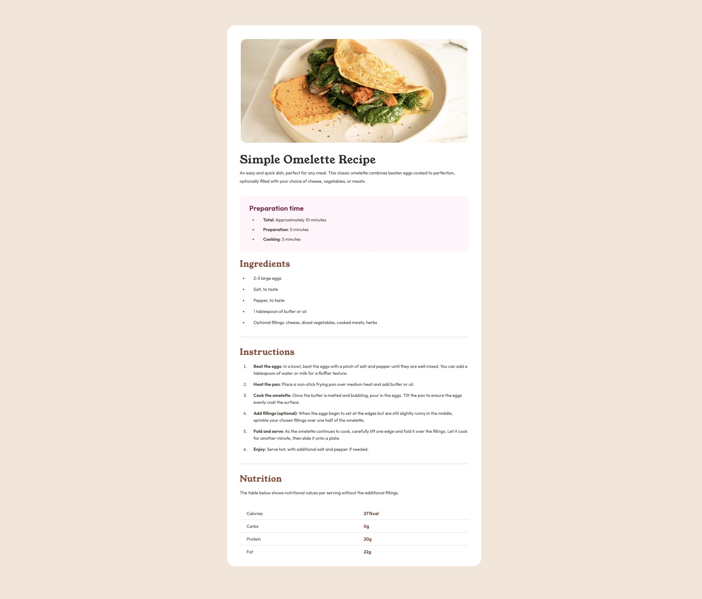
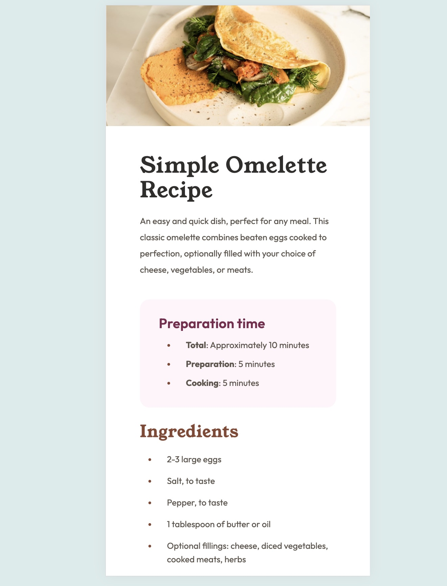

# Frontend Mentor - Recipe page solution

This is a solution to the [Recipe page challenge on Frontend Mentor](https://www.frontendmentor.io/challenges/recipe-page-KiTsR8QQKm).

## Table of contents
- [Screenshot](#screenshot)
- [Links](#links)
- [Built with](#built-with)
- [Author](#author)
- [Acknowledgments](#acknowledgments)

## Screenshot

## Links

- Solution URL: [Github](https://your-solution-url.com)
- Live Site URL: [Live](https://your-live-site-url.com)

## Built with

- Semantic HTML5 markup
- CSS
- Flexbox

## Author

- Github - [bkfoe](https://github.com/BKFOE)
- Frontend Mentor - [@bkfoe](https://www.frontendmentor.io/profile/bkfoe)

## Acknowledgments

